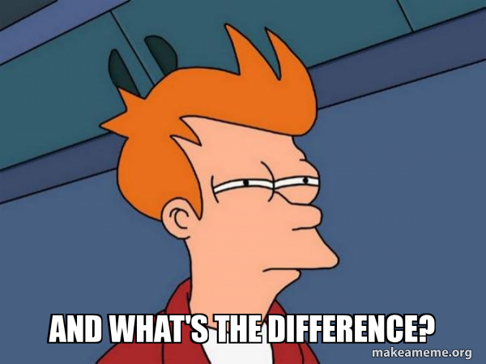

# Funções

Criar função é o ato de encapsular trechos de código que podem ser invocados ou chamados em outras partes do código, fortalecendo assim a reutilização. Podemos criar funções de 2 maneiras:

### Função simples

```javascript
// Através do function tradicional
function minhaFuncao() {
  // faz alguma coisa
}

//através de arrow function
const minhaFuncao = () => {
  // faz alguma coisa
};
```

✏️ Crie uma função que mostra um `console.log` contendo seu nome e sua idade.

##### Mas qual a diferença entre usar [function e arrow function](https://www.youtube.com/watch?v=S5Mn0qQzJ-0)?



✏️ Crie uma função que some dois numeros

## Função com parâmetros

As funções podem receber parametros, que são os dados necessários para sua execução. Os paramentros devem ser passados dentro do parentese. Por exemplo:

```javascript
// Através do function
function soma(n1, n2) {
  return n1 + n2;
}

//através de arrow function
const soma = (n1, n2) => {
  return n1 + n2;
};
```

## Mão na massa

✏️ Crie uma função que receberá 3 notas e dirá a média do estudante.

✏️ Crie uma função que recebe por parâmetro o tempo de duração expressa em segundos e retorna esse tempo em horas e minutos.

✏️ Crie uma função que receba três números, verifique e mostre o maior deles.

✏️ Crie uma função que receba um número e usando laços de repetição calcule e mostre a tabuada desse número
